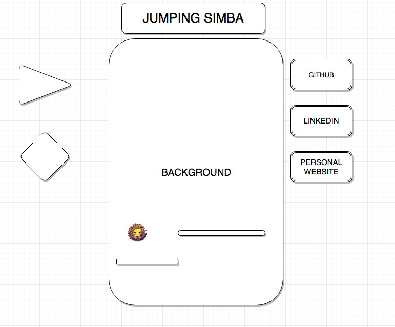

# Jumping Simba

### Background
Jumping Simba is an infinite platformer with Lion King themes. You play as Simba, jumping without any worries.
Simba must continue to run on platforms. A high score is given based on how far he goes before falling off the screen.

### Functionality & MVP  

Users will be able to:

- [ ] Start and pause the game.
- [ ] Jump to remain on alive on the platforms
- [ ] Earn a high score

In addition, this project will include:

- [ ] An About modal describing the background and rules of the game
- [ ] A production README

### Wireframes
- [ ] Single screen game board
- [ ] Game controls
- [ ] Nav links to Github, LinkedIn, Personal Website
- [ ] Instructions section

### Architecture and Technologies
This project will use the following technologies:
- Vanilla Javascript for game logic
- `DOMGO` my personal library(inspired by jQuery) for button inputs
- Webpack to bundle and serve up the various scripts

The following scripts will be needed:
- player.js to keep track of all jumping and collisions with the player object
- display.js to handle object rendering on the main game board
- moving_object.js this class will be the basis of all obstacles in the game
- platform.js manages all the platforms

### Features

#### Simba
- [ ] Moves with the screen
- [ ] Has a downward acceleration as long as it is not on a platform. (aka falling)  
- [ ] Landing on top of a platform will reset the Jumper's vertical velocity to zero.
- [ ] Can JUMP while on a platform, which instantaneously adds vertical velocity
- [ ] Dies upon contact with the bottom of the screen

#### Platforms
- [ ] Have a horizontal surface that can be jumped through but not dropped through
- [ ] Randomly generated (vertical position and length) at regular intervals

#### Game Logic
- [ ] Game updates timers to generate objects
- [ ] Game keeps track of score (time survived and treasures collected)
- [ ] Game keeps track of lives, subtracting one with each death and causing the game to end when out of lives

#### Display
- [ ] Displays current score and final score on game over
- [ ] Displays current number of lives

### Extras
- [ ] Pause function
- [ ] Collecting 10 coins gives you an extra Life
- [ ] Simba grows into an adult with more points

### Implementation Timeline

**Day 1**:
- Setup Node modules and webpack
- Write a basic entry file and the bare bones of all scripts
- Be able to understand how to render an object on `Canvas` and move object and environment

**Day 2**:

- Be able to make Simba jump
- Be able to trigger proper responses to missing a jump
- Have environment moving to left at constant speed

**Day 3**:

- Create backend to allow for global high score board
- Develop About modal with instructions and details
- Style visuals
